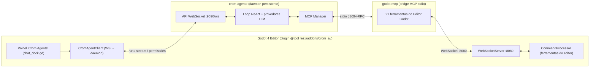

# 🌌 CromAI Godot Bridge — o Crom Agente acoplado ao Godot 4

Este projeto acopla o agente autônomo **[crom-agente](https://github.com/MrJc01/crom-agente)** diretamente ao editor do **Godot 4**, no mesmo espírito do **Antigravity para o VS Code**: o chat lateral da IDE **é** o agente, com leitura e escrita de scripts, manipulação de cenas e nós, e configuração do projeto — como um desenvolvedor de verdade.

O agente enxerga o projeto aberto, edita arquivos `.gd`/`.tscn`, move objetos na cena, cria cenas, define input maps e ajusta o `project.godot`, tudo por meio de **ferramentas MCP** expostas pelo próprio editor.

---

## 🧠 Como funciona (arquitetura)



1. O painel **Crom Agente** conversa com o **daemon** do crom-agente via WebSocket (`ws://127.0.0.1:9090/ws`): envia tarefas, recebe streaming, status e pedidos de permissão.
2. O daemon roda o loop ReAct e, para agir dentro do Godot, chama o **bridge MCP** (`godot-mcp`), um subprocesso stdio registrado automaticamente em `~/.crom/global.json`.
3. O bridge traduz cada ferramenta MCP em um comando JSON e o envia ao **WebSocket do plugin** (porta `8080`), onde o **CommandProcessor** executa a ação real no editor (adicionar nó, editar script, salvar cena, etc.).

Tudo é iniciado automaticamente pelo plugin: o daemon sobe sozinho e o servidor MCP é registrado na primeira ativação.

---

## 🚀 Começando

### 1. Ativar o plugin
1. Abra o projeto no **Godot 4.6+**.
2. **Projeto → Configurações → Plugins** → ative **CromAI MCP & Play Bridge**.
3. O painel **Crom Agente** aparece na barra direita. Na primeira vez, clique em **⚙** e configure o provedor (OpenRouter, Ollama, OpenAI, Anthropic, Gemini ou CromIA) e sua **API key** — armazenada localmente em `user://crom_ai_config.cfg`, nunca no repositório.

### 2. Conversar e comandar
Digite instruções em linguagem natural. Exemplos:
- *"Crie um `CharacterBody2D` chamado Player na cena e anexe um script de movimento."*
- *"Mova o nó Inimigo para a posição (400, 300) e pinte de vermelho."*
- *"Leia `res://scripts/player.gd` e adicione pulo duplo."*

O agente pede **permissão** antes de agir (a menos que você marque *Aprovar automaticamente*).

---

## 💬 Recursos do chat

- **Context chips (badges):** arraste scripts/cenas para o chat, clique com o **botão direito** em um arquivo ou nó → *"Enviar para o Crom Agente"*, ou use o botão **+**. Cada item vira um chip removível acima do input e é anexado como contexto ao enviar.
- **Slash commands:** digite `/` para abrir o menu. `/jogar`, `/jogar-cena <cena>` (lista as cenas do projeto), `/parar`, `/inspecionar`, `/arvore`, `/corrigir`, `/limpar`.
- **Detecção de erros:** quando o Godot reporta um `SCRIPT ERROR`, um aviso oferece **Corrigir agora** ou **Anexar ao chat** (o erro vira um chip de contexto).
- **Streaming e permissões (HITL):** respostas em tempo real, com botões *Permitir / Sempre permitir / Negar* para cada ferramenta.
- **Histórico de conversas** salvo em `user://crom_chat_history/`.

---

## 🧩 Ferramentas do editor expostas ao agente

Via o bridge `godot-mcp` (prefixo `godot_`):

**Cena e nós:** `get_scene_tree`, `add_node`, `remove_node`, `set_node_property`, `move_node`, `rename_node`, `reparent_node`, `instantiate_scene`.
**Scripts e arquivos:** `create_and_attach_script`, `read_project_file`, `modify_project_file`, `list_project_dir`.
**Cenas e projeto:** `create_scene`, `open_scene`, `save_scene`, `set_project_setting`, `add_input_action`.
**Execução e visão:** `play_scene`, `stop_scene`, `capture_screenshot`, `get_open_editor_context`.

---

## 🖥️ Crom Hub — gerenciador de projetos

A cena principal (`res://addons/crom_ai/ui/hub_controller.tscn`) é um hub minimalista, dark, dev-first:
- **Home:** projetos recentes, status do agente e ações rápidas.
- **Projetos:** CRUD completo — criar (com validação de nome), buscar, abrir na IDE, executar, renomear, favoritar, remover da lista e excluir do disco (com confirmação). Sem caminhos hardcoded: usa o executável do Godot em execução e o `projects.cfg` oficial por plataforma.
- **Playtest / Benchmark:** suíte de minijogos para stress test do agente.

---

## 🕹️ Suíte de minijogos (benchmark)

15 minijogos funcionais para validar geração/refatoração pela IA (Pong, Snake, Flappy, Breakout, Space Invaders, Tetris, Asteroids, Endless Runner, Top-Down Dungeon, Platformer, Tower Defense, Clicker Idle, Memory Match, Raycaster, 3D Rolling Ball).

## 🔧 Daemon, Binários e Testes no Terminal

O plugin embute os binários compilados em `addons/crom_ai/bin/`:
- `crom-agente-<os>-<arch>` — o daemon/agente.
- `godot-mcp-<os>-<arch>` — o bridge MCP (compilado a partir de `crom-godot-agent/go/`).

### 1. Recompilar o Bridge (Go)
Caso altere o código em Go, você pode recompilar o bridge manualmente:
```bash
cd crom-godot-agent/go
GOOS=linux GOARCH=amd64 go build -o ../../addons/crom_ai/bin/godot-mcp-linux-amd64 .
```

### 2. Abrir o Editor do Godot via Terminal
Inicie o editor apontando para a pasta do projeto:
```bash
godot --editor --path /home/j/Documentos/GitHub/crom-godot-ai
```
*(Certifique-se de que o plugin **CromAI MCP & Play Bridge** esteja ativado em **Projeto -> Configurações do Projeto -> Plugins**).*

### 3. Testar o Agente de Forma Interativa no Terminal
Com o editor do Godot aberto e o plugin ativo, você pode rodar e conversar com o agente diretamente do terminal usando o CLI em Go:
```bash
cd crom-godot-agent/go
go run . --provider <seu_provedor> --model <seu_modelo>
```
Exemplo para Ollama (Llama 3):
```bash
go run . --provider ollama --model llama3
```
Exemplo para Gemini (lembre-se de configurar a API key):
```bash
export GEMINI_API_KEY="sua_chave"
go run . --provider gemini --model google/gemini-2.5-flash
```

### 4. Uso Manual do Bridge (Debug/Stdio)
Para validar o bridge separadamente via JSON-RPC 2.0 (comunicação direta por stdin/stdout):
```bash
./addons/crom_ai/bin/godot-mcp-linux-amd64 --mcp-stdio --port 8080
```

## 🔐 Segurança

- API keys ficam **apenas** em `user://crom_ai_config.cfg` (fora do repo). O `.env` do workspace fica em `.crom/`, que está no `.gitignore`.
- ⚠️ **Aviso:** versões anteriores continham uma chave OpenRouter hardcoded no código. Ela foi removida, mas **permanece no histórico do git** — **revogue essa chave** no painel da OpenRouter e gere uma nova.

---

## 📜 Filosofia

Inspirado no ecossistema **[crom-agente](https://github.com/MrJc01/crom-agente)** de **MrJc01** e na experiência do **Antigravity/VS Code**, trazendo um agente de desenvolvimento nativo e acoplado para o **Godot Engine**.
