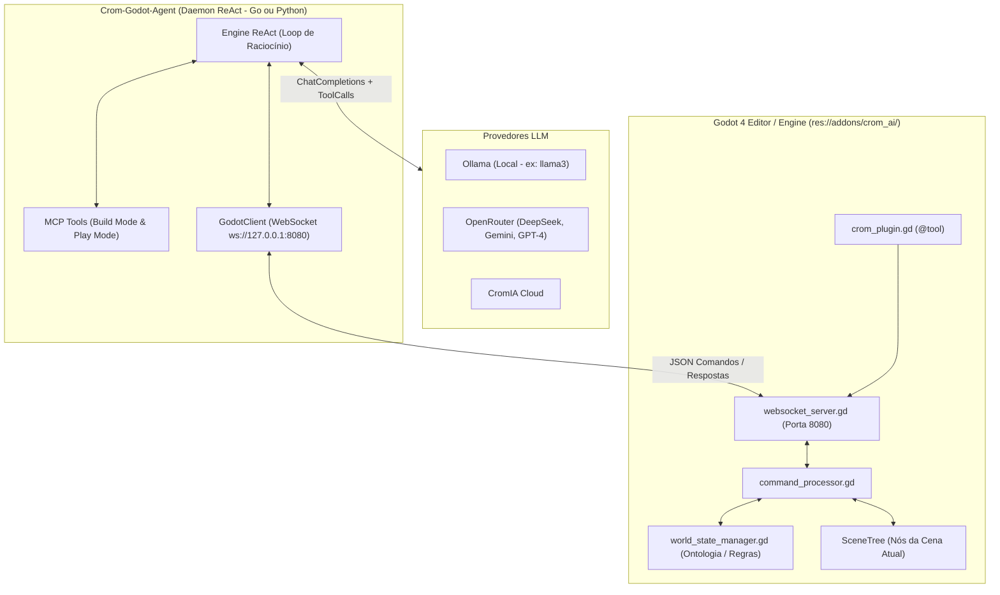

# 🌌 CromAI Godot Bridge & Agente ReAct (`crom-godot-ai`)

Este projeto unifica o poder autônomo do **[crom-agente](https://github.com/MrJc01/crom-agente)** (e a filosofia do *Antigravity / Roo / Cursor*) diretamente dentro do motor de jogos **Godot 4**. 

Através de uma arquitetura limpa dividida em **EditorPlugin (@tool)** no Godot + **Servidor/Daemon ReAct** externo (disponível em Go e Python), a Inteligência Artificial consegue **construir** o mundo (cenários, nós da cena, ontologia e scripts GDScript) e logo depois **jogar e interagir** com as próprias criações em tempo real via **WebSockets/MCP**!

---

## 🕹️ Como Acessar e Executar (Guia Passo a Passo desde o Menu Inicial)

O projeto está configurado para que o **Arcade Hub (`res://benchmark/arcade_hub.tscn`)** seja a **Cena Principal por padrão (`main_scene`)**. Siga este fluxo para testar e demonstrar no vídeo:

### Passo 1: Como Abrir o Godot (Comandos de Terminal e Cliques)

No seu terminal do Linux, dentro da pasta do projeto (`cd /home/j/Documentos/GitHub/crom-godot-ai`), você tem **3 comandos exatos** dependendo de onde quer começar:

* **Opção A — Abrir na Página Inicial / Menu de Projetos (`Project Manager`)**:
  ```bash
  godot -p
  ```
  *(ou `/home/j/.local/bin/godot -p`)*  
  ➔ **Onde clicar**: Quando a janela inicial abrir, clique no botão **"Importar"** (ou **"Adicionar"**), selecione o arquivo `/home/j/Documentos/GitHub/crom-godot-ai/project.godot` e depois dê **duplo clique no projeto `CromAI Godot Bridge`** para entrar na tela de edição.

* **Opção B — Abrir Direto na Tela de Edição (IDE do Godot)** *(Mais Rápido)*:
  ```bash
  godot -e
  ```
  *(ou `/home/j/.local/bin/godot -e`)*  
  ➔ Isso pula a tela de escolha e abre diretamente o **Editor Godot** com o projeto já carregado!

* **Opção C — Abrir Direto o Jogo / Arcade Hub (Sem o Editor)**:
  ```bash
  godot
  ```
  *(ou `/home/j/.local/bin/godot`)*  
  ➔ Como o projeto já está configurado por padrão para rodar o `res://benchmark/arcade_hub.tscn`, digitar apenas `godot` abre direto a janela do **Arcade Hub com a lista dos 15 jogos**!

### Passo 2: Acessando o Chat do Agente na Tela de Edição
1. Com o editor aberto, olhe na barra lateral direita superior: você verá a aba **"CromAI Chat"** ativa.
2. É por esse painel lateral que você conversa em tempo real com o motor ReAct (`google/gemini-2.5-flash`), sem precisar de terminais externos!

### Passo 3: O Fluxo de Gravação do Vídeo Demonstrativo
Para demonstrar a Inteligência Artificial construindo, verificando funcionalmente e rodando os jogos:
1. **Limpe o ambiente anterior**: No campo de texto da aba **CromAI Chat**, digite `/clean` (ou `/limpar`) e dê Enter. A pasta `res://games/` será zerada instantaneamente.
2. **Dispare a verificação ao vivo**: Digite `/benchmark` e dê Enter.
3. O agente pedirá confirmação interativa. Digite `sim` ou `confirmar`. Você verá o chat atualizando em tempo real com todas as respostas, relatórios de telemetria e checagem de código na IDE!
4. **Acesse a Central de Jogos (Arcade Hub)**: Pressione **`F5`** no teclado (ou clique no botão superior direito de **Play / Executar Projeto**).
   * Como o **Arcade Hub** está configurado por padrão no `project.godot`, ele abrirá imediatamente!
   * No painel lateral da View, você verá a lista em tempo real dos 15 jogos (`[Procedural] ✅`), com botões 100% clicáveis, telemetria de FPS/Memória ao vivo e tela em escala perfeita `16:9` (`1152x648`) via `TextureRect`.

---

## 📐 Arquitetura do Sistema



---

## 🚀 1. Novidade: Agente ReAct NATIVO & Chat Dock na IDE (`NativeReActEngine`)

Além da comunicação via WebSocket externo, o **CromAI Godot Bridge** agora conta com um **Motor ReAct Nativo em GDScript 4 (`NativeReActEngine` + `CommandProcessor`)** integrado à barra lateral do Editor Godot (`Chat Lateral da IDE`)!

* **Sem Dependências Externas Obrigatórias**: Você pode conversar e comandar a IA (via OpenRouter `google/gemini-2.5-flash`, Ollama Local, CromIA ou OpenAI) diretamente dentro do próprio editor, sem precisar rodar terminais separados em Go ou Python se não quiser.
* **Visão Multimodal (`capture_screenshot`)**: O agente é capaz de capturar screenshots reais em Base64 do seu jogo em execução, inspecionar o enquadramento, verificar a responsividade e corrigir bugs visuais de forma autônoma!
* **Leitura e Edição Pura de Projetos (`read_project_file` & `modify_project_file`)**: Capacidade de criar pastas, arquivos `.gd` sintaticamente perfeitos e cenas `.tscn` completas e funcionais.

---

## 🕹️ 2. Suíte de 15 Minijogos & Arcade Hub (`res://benchmark/`)

Para validar e demonstrar a capacidade de geração e refatoração da IA no Godot, foi criada uma suíte contendo **15 Minijogos Funcionais (60 FPS testados e auditados)**:

| # | ID do Jogo | Nome / Clone | Categoria | Mecânica Principal |
|---|---|---|---|---|
| **1** | `game_01_pong` | Pong Clássico | Procedural (2D) | Raquetes, bola física e placar de pontuação (`W/S` / Setas). |
| **2** | `game_02_snake` | Snake Grid | Procedural (2D) | Movimentação em grade, crescimento e coleta de maçãs. |
| **3** | `game_03_flappy` | Flappy Bird Clone | Assets SVG (2D) | Gravidade contínua, impulso (`Espaço` / Clique) e canos móveis. |
| **4** | `game_04_breakout` | Breakout Arkanoid | Procedural (2D) | Destruição de blocos em matriz, raquete controlada por mouse/teclado. |
| **5** | `game_05_space_invaders`| Space Invaders | Assets SVG (2D) | Tropa alienígena móvel, tiros a laser e pontuação. |
| **6** | `game_06_asteroids` | Asteroids Vetorial | Procedural (2D) | Rotação vetorial 360°, propulsão espacial e fragmentação de rochas. |
| **7** | `game_07_tetris` | Crom-Blocks Tetris | Procedural (2D) | Queda de peças (Tetrominoes), rotação e limpeza de linhas completas. |
| **8** | `game_08_endless_runner`| Endless Dino Runner| Procedural (2D) | Pulo de obstáculos em alta velocidade (estilo Chrome Dino). |
| **9** | `game_09_topdown_dungeon`| Top-Down Dungeon | Assets SVG (2D) | Exploração de masmorra em vista superior com herói, moedas e baús. |
| **10** | `game_10_platformer` | Super Crom Bros | Assets SVG (2D) | Física de plataforma, pulo, gravidade e colisão com moedas. |
| **11** | `game_11_tower_defense`| Tower Defense Mini | Procedural (2D) | Posicionamento de torres automáticas que atiram em ondas de inimigos. |
| **12** | `game_12_clicker_idle` | Crom Tycoon Idle | Procedural (2D) | Geração de recursos, upgrades exponenciais e multiplicadores. |
| **13** | `game_13_memory_match` | Card Memory Game | Assets SVG (2D) | Grade de cartas viradas para memorizar e encontrar pares iguais. |
| **14** | `game_14_raycaster` | 2D/3D CPU Raycaster| Procedural (2D/Control)| Renderização pseudo-3D via Raycasting em CPU (estilo Wolfenstein 3D). |
| **15** | `game_15_3d_rolling_ball`| 3D Rolling Ball | Assets 3D (`RigidBody3D`)| Ambiente 3D real com bola física rolando por um piso, câmera e moedas. |

### ⚡ Arcade Hub Interativo (`res://benchmark/arcade_hub.tscn`)
Abra a cena `arcade_hub.tscn` no editor Godot para acessar a central de testes:
* **Escala 16:9 Perfeita (`TextureRect` + `SubViewport 1152x648`)**: Os minijogos rodam de forma nativa e isolada a `1152x648` e são redimensionados dinamicamente no painel central por matemática vetorial (`STRETCH_KEEP_ASPECT_CENTERED`). Nunca haverá corte de placar, raquetes fora de tela ou perda de foco de teclado (`_input`).
* **Lista Dinâmica de Status**: Os botões da lista lateral verificam em tempo real se a cena `.tscn` existe no projeto (`[Procedural] ✅` vs `⏳`).
* **Controle do Agente ao Vivo**: Botões dedicados no painel direito para pedir à IA: **[🔍 Inspecionar Jogo]**, **[🎮 Jogar/Testar com Visão]** e **[🛠️ Otimizar Código]**, exibindo o raciocínio no log do painel!

---

### 💬 3. Comandos Interativos no Chat Lateral da IDE

Para demonstrações em vídeo e criação ágil, o **Chat Lateral** suporta comandos especiais direct-in-IDE:

* **`/clean`** *(ou `/limpar`)*:
  Limpa e remove instantaneamente todos os minijogos gerados dentro de `res://games/`, restaurando o ambiente limpo para uma nova construção.
* **`/benchmark`**:
  Dispara uma confirmação interativa no chat:
  > **⚡ Comando /benchmark detectado!**  
  > Deseja iniciar a verificação e construção funcional dos minijogos via Agente IA ReAct NATIVO para demonstração no vídeo?  
  > **👉 Digite 'confirmar' ou 'sim' para iniciar.**
  
  Ao responder `sim`, a engine aciona o loop ReAct, construindo, verificando códigos e relatando FPS e telemetria de memória diretamente no histórico de conversa da IDE em tempo real!

---

## 🛠️ 4. Como Ativar o Plugin no Godot 4

1. Abra a pasta do projeto (`/home/j/Documentos/GitHub/crom-godot-ai`) no **Godot 4.6+**.
2. No menu superior, vá em **Projeto** ➔ **Configurações do Projeto...** ➔ **Plugins**.
3. Marque a caixa **Ativar** ao lado de **CromAI MCP & Play Bridge**.
4. A barra lateral direita ganhará a aba **"CromAI Chat"** pronta para uso, junto com o servidor WebSocket na porta `8080`!

---

## 🚀 5. Como Rodar o Agente Externo (`crom-godot-agent`)

Caso prefira operar via terminal / daemon ReAct externo em **Go** ou **Python** se conectando via WebSocket (`ws://127.0.0.1:8080`):

### Opção A: Executando a versão em Go (`crom-godot-agent/go`)

```bash
cd crom-godot-agent/go
go build -o crom-godot-agent

# Rodar em modo interativo TUI usando Ollama local
./crom-godot-agent --provider ollama --model llama3

# Ou rodar conectando ao OpenRouter / CromIA Cloud
export OPENROUTER_API_KEY="sua_chave_aqui"
./crom-godot-agent --provider openrouter --model google/gemini-2.5-flash

# Ou executar um único comando/prompt diretamente via CLI:
./crom-godot-agent --prompt "Crie um nó Label3D na cena com texto 'Bem vindo ao CromAI' na posição (0, 3, 0)"
```

### Opção B: Executando a versão em Python (`crom-godot-agent/python`)

```bash
cd crom-godot-agent/python
pip install -r requirements.txt

# Rodar modo interativo com Ollama
python3 crom_godot_agent.py --provider ollama --model llama3

# Ou com OpenRouter
export OPENROUTER_API_KEY="sua_chave"
python3 crom_godot_agent.py --provider openrouter --model deepseek/deepseek-chat
```

---

## 🧩 6. As Ferramentas MCP Expostas para a IA

O `crom-godot-agent` provê duas modalidades de ferramentas que a IA alterna organicamente durante seu raciocínio (`ReAct`):

### 🔨 Pilar 1: Ferramentas de Construção (`Build Mode`)
* `get_scene_tree()`: Lê a árvore de nós atualmente aberta na IDE do Godot.
* `add_node(node_type, node_name, parent_path, properties)`: Cria nós em tempo real diretamente na cena (`Node3D`, `Sprite2D`, `Area3D`, `CollisionShape3D`, etc.).
* `set_node_property(node_path, property, value)`: Altera posições, cores, textos, visibilidade e parâmetros dinâmicos de qualquer nó.
* `create_and_attach_script(node_path, script_path, gdscript_code)`: Gera arquivos `.gd` com código **GDScript 4** sintaticamente correto, salva no diretório `res://scripts/` e anexa ao nó da cena instantaneamente!
* `create_location(location_id, name, description)`: Define salas, masmorras, cidades ou arenas no motor de ontologia (`CromWorldManager`).
* `create_entity(entity_id, location_id, type, properties)`: Adiciona baús, itens, armas, portas trancadas ou NPCs nos cenários.
* `define_rule(trigger_action, target_entity_id, conditions, results)`: Programa lógicas dinâmicas de reação de jogo (ex: *"Se o jogador usar 'abrir' no 'bau_01' e tiver 'chave_ouro', adicione 'espada_magica' ao inventário"*).
* `link_locations(location_a, location_b, direction)`: Interliga saídas e passagens do mundo.

### 🎮 Pilar 2: Ferramentas de Jogo e Visão (`Play Mode`)
* `switch_mode(mode="play")`: O agente sai do papel de "Desenvolvedor" e assume a identidade do "Jogador" dentro do mundo recém-criado.
* `capture_screenshot()`: Captura a tela atual do jogo ou do editor em Base64 e envia para a IA analisar visualmente a responsividade e o layout.
* `look_around()`: Observa o que há na sala atual (nome, descrição, saídas e entidades visíveis).
* `move(direction)`: Desloca o jogador pelo grafo do mapa.
* `interact(action, target_id, with_item_id)`: Executa ações (`abrir`, `pegar`, `examinar`, `atacar`) aplicando o motor de regras programado na fase de construção.
* `check_inventory_and_status()`: Consulta o HP atual, status do personagem e inventário de itens coletados.
* `play_scene(scene_path)` / `stop_scene()`: Inicia ou para a execução de teste da cena do Godot.

---

## 🎯 Exemplo de Sessão com o Agente

**Usuário:**
> *"Crie um mini-jogo de fuga de uma prisão medieval. Coloque uma cela inicial, um corredor com um guarda dormindo e uma chave escondida. Depois, mude para o modo de jogo e tente escapar sozinho!"*

**Raciocínio e Ações do Agente via ReAct Loop:**
1. **[Tool: `create_location`]** ➔ Cria sala `"cela_01"` (*"Cela Escura"*) e `"corredor_01"` (*"Corredor de Pedra"*).
2. **[Tool: `link_locations`]** ➔ Conecta `"cela_01"` a `"corredor_01"` pela direção `"norte"`.
3. **[Tool: `create_entity`]** ➔ Cria entidade `"chave_ferro"` dentro de `"cela_01"` e `"porta_ferro"` no caminho para o corredor.
4. **[Tool: `define_rule`]** ➔ Programa regra: ação `"abrir"` na `"porta_ferro"` com condição `{"has_item": "chave_ferro"}` libera passagem (`{"message": "A porta se abre com um rangido!"}`).
5. **[Tool: `add_node`]** ➔ Adiciona nós visuais na `SceneTree` do Godot (`Label3D` com título *"Prisão de Crom"*).
6. **[Tool: `switch_mode`]** ➔ Alterna para `mode="play"`.
7. **[Tool: `look_around`]** ➔ Vê a chave de ferro no chão da cela.
8. **[Tool: `interact`]** ➔ Executa `interact("pegar", "chave_ferro")` ➔ Item vai para o inventário.
9. **[Tool: `interact`]** ➔ Executa `interact("abrir", "porta_ferro", "chave_ferro")` ➔ Regra dispara com sucesso!
10. **[Tool: `move`]** ➔ Executa `move("norte")` ➔ Chega ao corredor e vence o jogo!

---

## 📜 Filosofia e Licenciamento

Este projeto é diretamente inspirado pelo ecossistema **[crom-agente](https://github.com/MrJc01/crom-agente)** do desenvolvedor **MrJc01**, trazendo a mesma independência modular (`Daemon Go + SDK + WebSocket Bridge + Native ReAct Engine in Godot`) para revolucionar a forma como criamos e jogamos com Inteligências Artificiais no **Godot Engine**.
