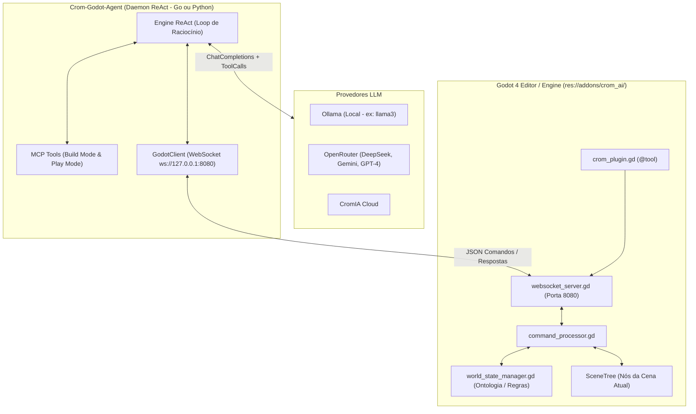

# 🌌 CromAI Godot Bridge & Agente ReAct (`crom-godot-ai`)

Este projeto unifica o poder autônomo do **[crom-agente](https://github.com/MrJc01/crom-agente)** (e a filosofia do *Antigravity / Roo / Cursor*) diretamente dentro do motor de jogos **Godot 4**. 

Através de uma arquitetura limpa dividida em **EditorPlugin (@tool)** no Godot + **Servidor/Daemon ReAct** externo (disponível em Go e Python), a Inteligência Artificial consegue **construir** o mundo (cenários, nós da cena, ontologia e scripts GDScript) e logo depois **jogar e interagir** com as próprias criações em tempo real via **WebSockets/MCP**!

---

## 📐 Arquitetura do Sistema



---

## 🛠️ 1. Como Ativar no Godot 4

1. Abra a pasta do projeto (`/home/j/Documentos/GitHub/crom-godot-ai`) no **Godot 4.6+**.
2. No menu superior, vá em **Projeto** ➔ **Configurações do Projeto...** ➔ **Plugins**.
3. Marque a caixa **Ativar** ao lado de **CromAI MCP & Play Bridge**.
4. No console de saída do Godot (`Saída`), você verá:
   ```text
   =========================================================
   [CromAI Bridge] Carregando plugin do Editor no Godot...
   [CromAI WebSocket] Servidor ativo e escutando na porta 8080 (ws://127.0.0.1:8080)
   [CromAI Bridge] Sistema pronto! Conecte seu Servidor MCP/IA na porta 8080.
   =========================================================
   ```

---

## 🚀 2. Como Rodar o Agente (`crom-godot-agent`)

Você pode rodar o agente tanto em **Go** (alta performance e compatibilidade com o ecossistema original do `crom-agente`) quanto em **Python**.

### Opção A: Executando a versão em Go (`crom-godot-agent/go`)

```bash
cd crom-godot-agent/go
go build -o crom-godot-agent

# Rodar em modo interativo TUI usando Ollama local
./crom-godot-agent --provider ollama --model llama3

# Ou rodar conectando ao OpenRouter / CromIA Cloud
export OPENROUTER_API_KEY="sua_chave_aqui"
./crom-godot-agent --provider openrouter --model google/gemini-2.5-flash

# Ou executar um único comando/prompt diretamente via CLI:
./crom-godot-agent --prompt "Crie um nó Label3D na cena com texto 'Bem vindo ao CromAI' na posição (0, 3, 0)"
```

### Opção B: Executando a versão em Python (`crom-godot-agent/python`)

```bash
cd crom-godot-agent/python
pip install -r requirements.txt

# Rodar modo interativo com Ollama
python3 crom_godot_agent.py --provider ollama --model llama3

# Ou com OpenRouter
export OPENROUTER_API_KEY="sua_chave"
python3 crom_godot_agent.py --provider openrouter --model deepseek/deepseek-chat
```

---

## 🧩 3. As Ferramentas MCP Expostas para a IA

O `crom-godot-agent` provê duas modalidades de ferramentas que a IA alterna organicamente durante sua raciocínio (`ReAct`):

### 🔨 Pilar 1: Ferramentas de Construção (`Build Mode`)
* `get_scene_tree()`: Lê a árvore de nós atualmente aberta na IDE do Godot.
* `add_node(node_type, node_name, parent_path, properties)`: Cria nós em tempo real diretamente na cena (`Node3D`, `Sprite2D`, `Area3D`, `CollisionShape3D`, etc.).
* `set_node_property(node_path, property, value)`: Altera posições, cores, textos, visibilidade e parâmetros dinâmicos de qualquer nó.
* `create_and_attach_script(node_path, script_path, gdscript_code)`: Gera arquivos `.gd` com código **GDScript 4** sintaticamente correto, salva no diretório `res://scripts/` e anexa ao nó da cena instantaneamente!
* `create_location(location_id, name, description)`: Define salas, masmorras, cidades ou arenas no motor de ontologia (`CromWorldManager`).
* `create_entity(entity_id, location_id, type, properties)`: Adiciona baús, itens, armas, portas trancadas ou NPCs nos cenários.
* `define_rule(trigger_action, target_entity_id, conditions, results)`: Programa lógicas dinâmicas de reação de jogo (ex: *"Se o jogador usar 'abrir' no 'bau_01' e tiver 'chave_ouro', adicione 'espada_magica' ao inventário"*).
* `link_locations(location_a, location_b, direction)`: Interliga saídas e passagens do mundo.

### 🎮 Pilar 2: Ferramentas de Jogo (`Play Mode`)
* `switch_mode(mode="play")`: O agente sai do papel de "Desenvolvedor" e assume a identidade do "Jogador" dentro do mundo recém-criado.
* `look_around()`: Observa o que há na sala atual (nome, descrição, saídas e entidades visíveis).
* `move(direction)`: Desloca o jogador pelo grafo do mapa.
* `interact(action, target_id, with_item_id)`: Executa ações (`abrir`, `pegar`, `examinar`, `atacar`) aplicando o motor de regras programado na fase de construção.
* `check_inventory_and_status()`: Consulta o HP atual, status do personagem e inventário de itens coletados.
* `play_scene(scene_path)` / `stop_scene()`: Inicia ou para a execução de teste da cena do Godot.

---

## 🎯 Exemplo de Sessão com o Agente

**Usuário:**
> *"Crie um mini-jogo de fuga de uma prisão medieval. Coloque uma cela inicial, um corredor com um guarda dormindo e uma chave escondida. Depois, mude para o modo de jogo e tente escapar sozinho!"*

**Raciocínio e Ações do Agente (`crom-godot-agent` via ReAct Loop):**
1. **[Tool: `create_location`]** ➔ Cria sala `"cela_01"` (*"Cela Escura"*) e `"corredor_01"` (*"Corredor de Pedra"*).
2. **[Tool: `link_locations`]** ➔ Conecta `"cela_01"` a `"corredor_01"` pela direção `"norte"`.
3. **[Tool: `create_entity`]** ➔ Cria entidade `"chave_ferro"` dentro de `"cela_01"` e `"porta_ferro"` no caminho para o corredor.
4. **[Tool: `define_rule`]** ➔ Programa regra: ação `"abrir"` na `"porta_ferro"` com condição `{"has_item": "chave_ferro"}` libera passagem (`{"message": "A porta se abre com um rangido!"}`).
5. **[Tool: `add_node`]** ➔ Adiciona nós visuais na `SceneTree` do Godot (`Label3D` com título *"Prisão de Crom"*).
6. **[Tool: `switch_mode`]** ➔ Alterna para `mode="play"`.
7. **[Tool: `look_around`]** ➔ Vê a chave de ferro no chão da cela.
8. **[Tool: `interact`]** ➔ Executa `interact("pegar", "chave_ferro")` ➔ Item vai para o inventário.
9. **[Tool: `interact`]** ➔ Executa `interact("abrir", "porta_ferro", "chave_ferro")` ➔ Regra dispara com sucesso!
10. **[Tool: `move`]** ➔ Executa `move("norte")` ➔ Chega ao corredor e vence o jogo!

---

## 📜 Filosofia e Licenciamento

Este projeto é diretamente inspirado pelo ecossistema **[crom-agente](https://github.com/MrJc01/crom-agente)** do desenvolvedor **MrJc01**, trazendo a mesma independência modular (`Daemon Go + SDK + WebSocket Bridge + Sandbox`) para revolucionar a forma como criamos e jogamos com Inteligências Artificiais no **Godot**.
