# 🏗️ Arquitetura em Camadas do Ecossistema `crom-godot-ai`

Inspirada na estrutura modular do **Antigravity / crom-agente**, nossa arquitetura divide responsabilidades em repositórios e módulos independentes, conectando o núcleo C++ do Godot, o motor ReAct em Go e as interfaces visuais.

```mermaid
flowchart TD
    subgraph CLOUD ["Camada Cloud & Provedores"]
        Ollama["Ollama Local (llama3 / qwen)"]
        OpenRouter["OpenRouter (DeepSeek, Gemini, GPT-4)"]
        CromIA["CromIA Cloud Gateway"]
    end

    subgraph DAEMON ["Camada Core ReAct (Daemon local — Go/Python)"]
        AgenteGo["crom-godot-agent (Go)"]
        AgentePy["crom-godot-agent (Python)"]
        DaemonOrig["external/crom-agente (Go Core & PTY Sandbox)"]
        
        DaemonOrig --> AgenteGo
    end

    subgraph ENGINE_CPP ["Camada Engine C++ (external/godot ➔ crom-godot-ide)"]
        GodotCPP["Godot Engine C++ Core (`external/godot/`)"]
        EditorNode["editor/editor_node.cpp (Painel Embutido C++)"]
        ScriptEditor["editor/plugins/script_editor_plugin.cpp (GDScript Diff)"]
        
        GodotCPP --> EditorNode
        GodotCPP --> ScriptEditor
    end

    subgraph BRIDGE_GD ["Camada Bridge & UI (@tool Plugin e Cenas)"]
        ChatDock["addons/crom_ai/chat_dock.tscn (Chat Dock na IDE)"]
        WSServer["addons/crom_ai/websocket_server.gd (Porta 8080)"]
        CommandProc["addons/crom_ai/command_processor.gd"]
        WorldManager["addons/crom_ai/world_state_manager.gd (Ontologia)"]
        MainScene["scenes/main.tscn (App Jogável com Overlay de Chat)"]
    end

    AgenteGo <-->|ChatCompletions JSON| CLOUD
    AgentePy <-->|ChatCompletions JSON| CLOUD

    AgenteGo <-->|WebSocket IPC ws://127.0.0.1:8080| WSServer
    AgentePy <-->|WebSocket IPC ws://127.0.0.1:8080| WSServer

    WSServer <--> CommandProc
    CommandProc <--> WorldManager
    CommandProc <-->|Manipula nós, GDScript e cena| MainScene

    style GodotCPP fill:#1e1e2e,stroke:#f38ba8,stroke-width:2px,color:#fff
    style AgenteGo fill:#0f172a,stroke:#89b4fa,stroke-width:2px,color:#fff
    style ChatDock fill:#181825,stroke:#a6e3a1,stroke-width:2px,color:#fff
```

---

## 📦 Detalhamento das 4 Camadas

### 1. Camada Engine C++ — O Fork Nativo (`external/godot/`)
Clonamos o repositório original do **Godot Engine (`godotengine/godot`)** em `external/godot/`. Esta camada é onde as modificações de baixo nível acontecem para criar o nosso próprio binário **`crom-godot-ide`**:
* **Modificação de `EditorNode` (`editor/editor_node.cpp`)**: Adiciona nativamente o painel de chat e status da IA na barra lateral da IDE C++, sem depender de scripts `@tool` externos.
* **Integração no `ScriptEditor` (`editor/plugins/script_editor_plugin.cpp`)**: Permite que a LLM aplique substituições de código (`replace_file_content` / `multi_replace`) exibindo um diff de cores (verde/vermelho) direto na aba de código do Godot, exatamente como o Void fez com o VS Code.
* **Acesso Direto à Memória (`SceneTree` & `ClassDB`)**: Elimina a necessidade de serializar tudo para JSON no longo prazo, permitindo consultas instantâneas ao estado da cena em C++.

### 2. Camada Core ReAct — O Daemon (`external/crom-agente` & `crom-godot-agent/`)
Aqui reside a inteligência e o loop **ReAct (Reasoning and Acting)**:
* **`external/crom-agente/`**: A clonagem do repositório core original em Go de autoria de MrJc01. Fornece a infraestrutura de sandbox PTY no terminal, permissões Human-In-The-Loop (HITL) e o protocolo de comunicação.
* **`crom-godot-agent/go/`**: O nosso daemon especializado que se conecta tanto aos provedores LLM quanto ao servidor WebSocket do Godot na porta `8080`, traduzindo a intenção textual do usuário nas 14 ferramentas de **Build Mode** e **Play Mode**.
* **`crom-godot-agent/python/`**: Versão espelhada em Python (`crom_godot_agent.py`) para quem deseja acoplar agentes com bibliotecas como PyTorch ou frameworks de aprendizado por reforço.

### 3. Camada de Ponte e Prototipagem (`addons/crom_ai/`)
Enquanto compilamos o executável C++ modificado via `scons`, esta camada implementa 100% da funcionalidade dentro de qualquer Godot 4 normal através de um plugin `@tool`:
* **`crom_plugin.gd`**: Registra o **CromAI Chat Dock** automaticamente na barra lateral direita (`EditorPlugin.DOCK_SLOT_RIGHT_UL`).
* **`websocket_server.gd`**: Escuta conexões do daemon Go/Python.
* **`command_processor.gd`**: Executa comandos de manipulação (`add_node`, `set_node_property`, `create_and_attach_script`, `play_scene`).
* **`world_state_manager.gd`**: Mantém o estado ontológico (locais, entidades, regras) no modo de construção e gerencia o jogador corporificado no modo de jogo (`look_around`, `move`, `interact`).
* **`native_react_engine.gd`**: Permite rodar o loop ReAct diretamente em GDScript dentro da barra lateral ou do jogo, fazendo requisições `HTTPRequest` assíncronas para Ollama ou OpenRouter (`google/gemini-2.5-flash`).

### 4. Camada de Cenas e Aplicativo (`scenes/main.tscn`)
Uma cena 3D interativa configurada com um `CanvasLayer Overlay` que exibe o jogo e o **Chat Lateral** na mesma tela ao ser executado (`F5`), demonstrando a transição fluida entre **Modo Build** (criar a masmorra e as regras) e **Modo Play** (jogar a masmorra e escapar via comandos ou inputs simulados).
